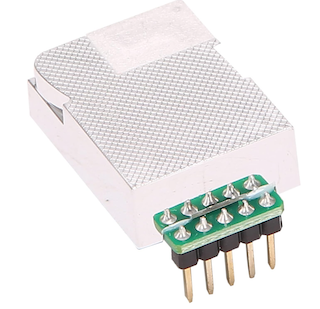
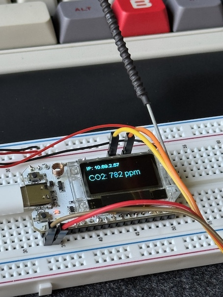
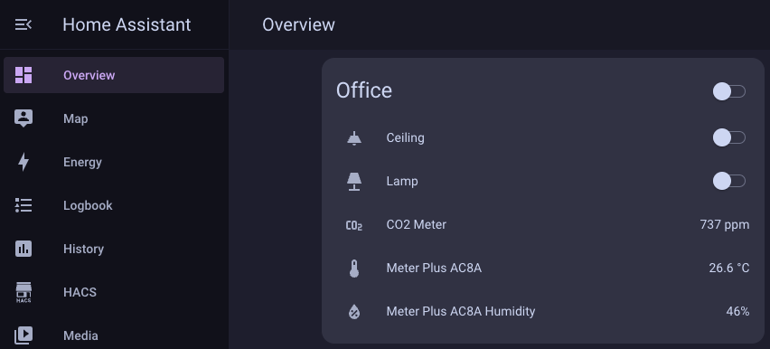

# ESP32 CO2 Meter with Home Assistant Integration

This guide will walk you through the steps to set up an ESP32-based CO2 meter using the Z19E sensor that displays readings on an integrated OLED screen and integrates with Home Assistant.

- I used the Hefddehy [Z19E IR Infrared CO2 Sensor](https://amzn.eu/d/8lvjU5Q) which I bought on Amazon for ~20 Euro.

- I used a breadboard to start but will move it into a project box later.

## Step-by-Step Instructions

### Prerequisite Steps

- Install the ESP32 Board software, for the Heltec 32 V3 steps can be found [here](https://github.com/HelTecAutomation/Heltec_ESP32).

### 1. **Hardware Setup**

#### ESP32 Firmware

You can view and download the ESP32 firmware [here](./esp32_code.ino).

- **ESP32 Board**: Use a Heltec WiFi LoRa 32 (v3) or another ESP32 with an integrated OLED display.
- **MH-Z19E CO2 Sensor**: Connect the sensor's TX pin to GPIO 3 and RX pin to GPIO 1 of the ESP32.
- **Power and Ground**: Connect the sensor's `VCC` to 5V and `GND` to the ground on the ESP32.

### 2. **Library Installation**

- **Arduino IDE**: Ensure you have the following libraries installed:
  - `WiFi.h`
  - `ESPAsyncWebServer.h`
  - `MHZ19.h`
  - `HT_SSD1306Wire.h` (specific for Heltec boards)

- Install any missing libraries through the Arduino Library Manager.

### 3. **Code Upload**

- **Open the Arduino IDE** and load the final code provided above.
- **Configure WiFi**: Replace the `ssid` and `password` variables with your network’s credentials.
- **Upload the code** to the ESP32 using the Arduino IDE.

### 4. **Home Assistant Setup**

- **Add a Sensor** in your `configuration.yaml` or another YAML file:

#### Home Assistant Configuration

You can view and download the Home Assistant configuration [here](./config/home_assistant.yaml).

- Replace `<esp32-ip>` with the actual IP address of your ESP32, which will be displayed on the OLED screen.

- **Restart Home Assistant** to apply the changes.

### 5. **Assigning the Sensor to an Area**

- Go to **Settings > Devices & Services** in Home Assistant.
- Find the `CO2 Sensor` entity and assign it to the "Office" area or any other area you prefer.

### 6. **Verify Everything is Working**

- **Monitor the OLED**: The OLED display should show the current CO2 PPM reading along with the IP address of the ESP32.
- **Check Home Assistant**: Ensure that the CO2 reading is being correctly pulled into Home Assistant and displayed in the UI.

- It should look something like this when you're done:

### 7. **Optional Automations**

- Create automations in Home Assistant based on CO2 levels, such as sending notifications or triggering actions if CO2 exceeds certain thresholds.

## Summary

By following these steps, you should have a fully operational CO2 meter integrated with Home Assistant, displaying real-time data both on the OLED and within the Home Assistant interface.
